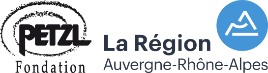
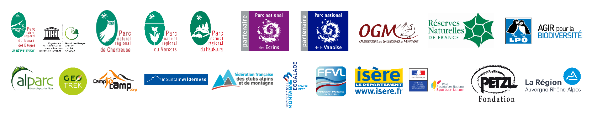

# Widget Biodiv'Sport générant automatiquement des cartes iframe à intégrer

Ce projet est un outil de consultation des données du projet [Biodiv'Sport](https://biodiv-sports.fr).

Il permet de générer un iframe ou une url de consultation des zones pour une pratique, une période et une zone donnée. 

# Licence:
* licence GPL3

# Un projet développé par
* [LPO Auvergne-Rhône-Alpes](https://auvergne-rhone-alpes.lpo.fr)

# Un projet financé par
* [Fondation Petzl](https://www.petzl.com/fondation/fondation-petzl)
* [Région Auvergne-Rhône-Alpes](https://www.auvergnerhonealpes.fr/)

# Les partenaires du projet

